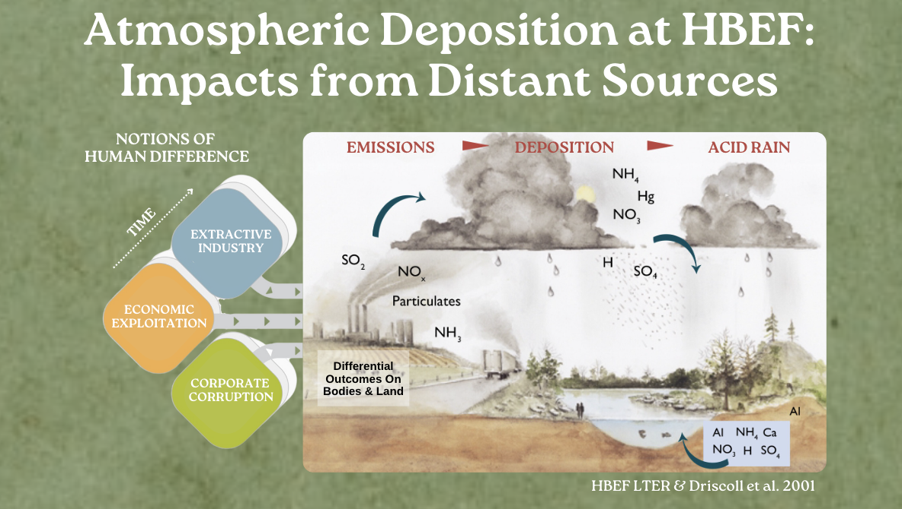

---


# Critical Ecology x Hubbard Brook: Social Drivers of Acid Rain Research Project

<p align="left">
  
</p>


---


## Overview  

Critical Ecology integrates socio-political analysis into environmental science to understand how power structures, race, class, and gender shape both environmental degradation and the policies designed to mitigate it. This project applies that lens to explore how systemic inequities and profit-driven industrial activities have influenced pollutant emissions across space and time in the United States.


---


<p align="center">
  
</p>


---


## Structure  

```
critical-ecology-hubbardbrook-project/
├── Scripts/
│   ├── Data Wrangling & Analysis Scripts
│   └── Modeling & Visualization
├── Output/
│   ├── Figures/
│   ├── Tables/
│   └── Sheets/
├── Data/
│   ├── EPA Data
│   ├── Census Data
│   ├── GCIP and GEO-WEALTH
│   └── Historical Inequality Sources
├── Figures/
├── Functions/
├── References.bib
├── README.md
└── critical-ecology-hubbardbrook-project.Rproj

```


---

### Main Research Question

Q: How do economic and demographic factors—including minimum wage and laborer identity (race & gender)—influence SO₂ emissions, particularly before and after the Clean Air Act?
	•	H1: Polluting facilities are disproportionately located in politically marginalized, predominantly nonwhite communities.
	•	H2: States with lower labor costs and higher proportions of racialized workers exhibit higher SO₂ and NOₓ emissions.
	•	H3: While the Clean Air Act reduced overall emissions, pollution burdens shifted toward historically redlined or politically underrepresented areas.

---

### Data Sources  

This project draws on a range of ecological, emissions, and socio-economic datasets to examine how systemic inequities and industrial activities have shaped pollutant emissions and environmental policy responses in the United States.  

- **Hubbard Brook LTER:** Long-term ecological datasets from the Hubbard Brook Experimental Forest, including records on acid rain and biogeochemical cycling.  
- **EPA Acid Rain Program (ARP) via CAMPD:** Facility-level sulfur dioxide (SO₂) and nitrogen oxides (NOₓ) emissions data from power plants, covering periods before and after the Clean Air Act Amendments.  
- **EPA National Emissions Inventory (NEI):** Annual nationwide emissions data from point sources, non-point sources, and transportation sectors.  
- **IPUMS CPS (Current Population Survey):** Microdata on labor force participation, income, demographics, and economic activity.  
- **IPUMS NHGIS (National Historical Geographic Information System):** Historical demographic and socio-economic data aggregated at multiple geographic scales.  
- **Labor Force Statistics:** Supplemental employment and wage data disaggregated by race and region.  
- **HOLC Redlining Maps:** Digitized historical maps of redlined neighborhoods from the University of Richmond’s Mapping Inequality project.  
- **Census Data:** Social Vulnerability Index (SVI) indicators and additional economic metrics for understanding community vulnerability.  
- **Gini Coefficients:** Income inequality measures derived from peer-reviewed economic research.  


### **Contact Information:**
**Robert J. Dellinger**  
**Ph.D. Student, Atmospheric & Oceanic Sciences, UCLA**  
**rjdellinger[at]ucla.edu**  

[](https://github.com/rob-dellinger)  


---

