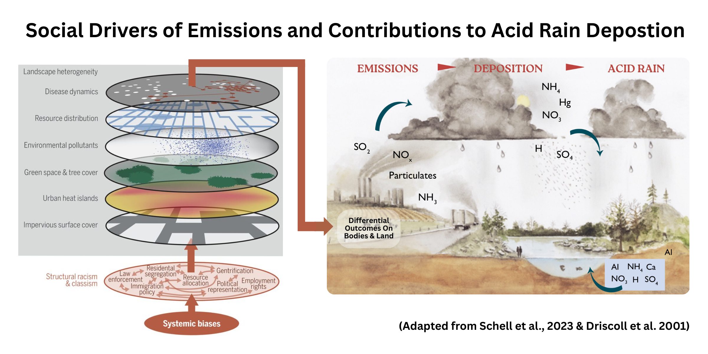

---

<p align="center">
  
  <strong style="font-size:28px; vertical-align:middle;">×</strong>
  
</p>

<h1 align="center" style="margin-top:10px;">Socio-Economic Drivers of Acid Rain Research Project</h1>

---


## Overview  

Critical Ecology integrates socio-political analysis into ecology to understand how power structures, race, class, and gender shape both ecological change and the policies designed to mitigate it. This project applies that lens to explore how systemic inequities and profit-driven industrial activities have influenced pollutant emissions across space and time in the United States.

Further background and research context for this project can be found in:  

[`Research-Background.pdf`](Research-Background.pdf)

---


<p align="center">
  
</p>


---


## Structure  

```
critical-ecology-lab/
├── Scripts/
│   ├── Data Wrangling & Analysis Scripts
│   └── Modeling & Visualization
├── Output/
│   ├── Figures/
│   ├── Tables/
│   └── Sheets/
├── Data/
│   ├── EPA Data
│   ├── Census Data
│   ├── Wealth Inequality Data
│   └── Historical Inequality Data
├── Figures/
├── Functions/
├── References.bib
├── README.md
└── critical-ecology-lab.Rproj

```

## Data Folder  

This folder is intentionally excluded from version control due to size limitations.  
Raw datasets are hosted externally on Google Drive:  

[Download Data Folder](https://drive.google.com/drive/folders/1MKnRw6FY3KVzzLRAAuqs8jeEAclUOHdr?usp=sharing)  

**Instructions:**  
1. Download the archive and place it into `Data/` at the root of this project.  
2. Keep the folder structure intact (scripts assume these relative paths).  
3. Do not commit or push raw data to GitHub. Derived products (tables, sheets, figures) should go in `Output/`.  

*Note: Large rendered HTML reports are tracked with Git LFS, but raw data is excluded entirely.* 

---

## Main Research Question  

This project investigates: **Does structural inequality shape the sources and quantity of emissions that contribute to acid rain deposition at Hubbard Brook?**  
  
We test three specific hypotheses:  

- **H1: Facility location.** Power plants and other high-emission facilities are disproportionately sited in historically marginalized communities, including neighborhoods graded “hazardous” (D) or “declining” (C) by the Home Owners’ Loan Corporation (HOLC).  

- **H2: Social vulnerability.** Census tracts with higher social vulnerability (lower income, higher poverty rates, greater proportion of racialized residents) have higher SO₂ and NOₓ emissions.  

- **H3: Labor and inequality.** Counties with lower labor costs and larger proportions of racialized workers show higher emissions, indicating that economic and racial inequities influence where pollution is produced and who bears the costs.  

---

## Data Sources  

This project integrates environmental and socio-economic datasets to analyze how systemic inequities and industrial activities have shaped pollutant emissions in states that have played a significant role in acid rain deposition at Hubbard Brook Experimental Forest.  

**Ecological Data**  
- **Hubbard Brook LTER:** Long-term ecological monitoring from the Hubbard Brook Experimental Forest, including acid rain deposition, hydrology, and biogeochemical cycling.  

**Emissions Data**  
- **EPA Acid Rain Program (ARP) via CAMPD:** Facility-level sulfur dioxide (SO₂) and nitrogen oxides (NOₓ) emissions from regulated power plants under the Clean Air Act Amendments. These data provide high-resolution, unit-level records of emissions before and after cap-and-trade implementation.  
- **EPA Clean Air Markets Program Data (CAMPD):** Facility-level emissions aggregated to the county scale, enabling linkage with demographic and socio-economic indicators.  
- **EPA National Emissions Inventory (NEI):** Annual, nationwide estimates of SO₂, NOₓ, NH₃, and other pollutants from point sources (industrial facilities), non-point sources (e.g., agriculture, residential), and mobile sources. NEI data are compiled at facility, county, and state levels, enabling long-term trend analysis (1990–2020).  

**Socio-Economic & Demographic Data**  
- **IPUMS CPS (Current Population Survey):** Microdata on labor force participation, wages, and demographic composition, used to assess how labor costs and worker identities intersect with pollution burdens.  
- **IPUMS NHGIS (National Historical Geographic Information System):** Aggregated historical demographic and socio-economic indicators at census tract, county, and state levels, enabling spatial analysis of inequality over time.  
- **Census Bureau Social Vulnerability Index (SVI):** Indicators of community vulnerability (income, housing, race/ethnicity, disability, etc.), available at county and tract scales for 2000, 2010, and 2020.  
- **Labor Force Statistics:** Supplemental state- and county-level employment and wage data disaggregated by race, ethnicity, and gender.  

**Historical Inequality & Structural Racism**  
- **Mapping Inequality Project (HOLC “Redlining” Maps):** Digitized Home Owners’ Loan Corporation maps and area descriptions from the 1930s. Used to assess how redlined neighborhoods correspond to contemporary pollution burdens.  
- **HOLC Crosswalks:** Tract-level crosswalks linking historic HOLC polygons with 2000, 2010, and 2020 Census geographies (geoJSON/GPKG).  
- **Historic Redlining Indicators (HRI):** National tract-level scores (2000, 2010, 2020) quantifying exposure to HOLC-graded areas.  
- **Wealth Inequality Data (GCIP and GEO-WEALTH):** Measures of income and wealth inequality across counties, commuting zones, and states, including Gini coefficients, Lorenz curves, and inequality decomposition.  

### Reproducibility Note  

All raw data are publicly available from EPA, Census, and other repositories.  
Google Drive is provided here only as a consolidated archive for convenience. 

---

### **Contact Information:**
**Robert J. Dellinger**  
**Ph.D. Student, Atmospheric & Oceanic Sciences, UCLA**  
**rjdellinger[at]ucla.edu**  

[](https://github.com/rob-dellinger)  


---

